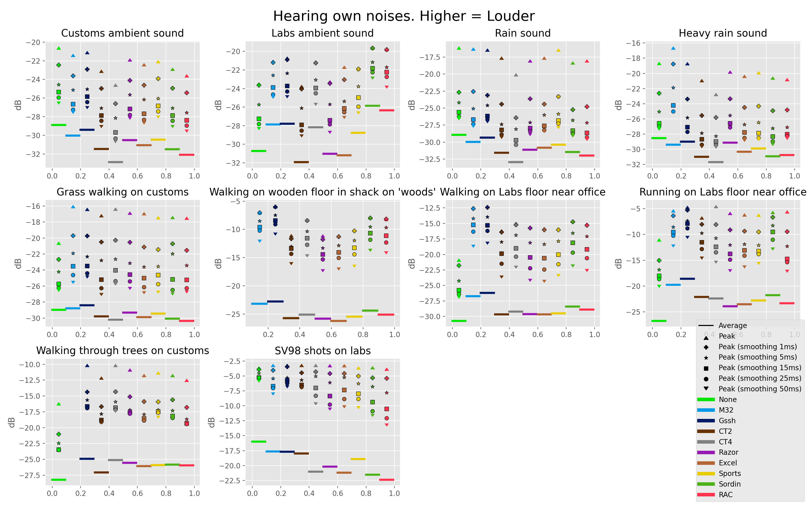
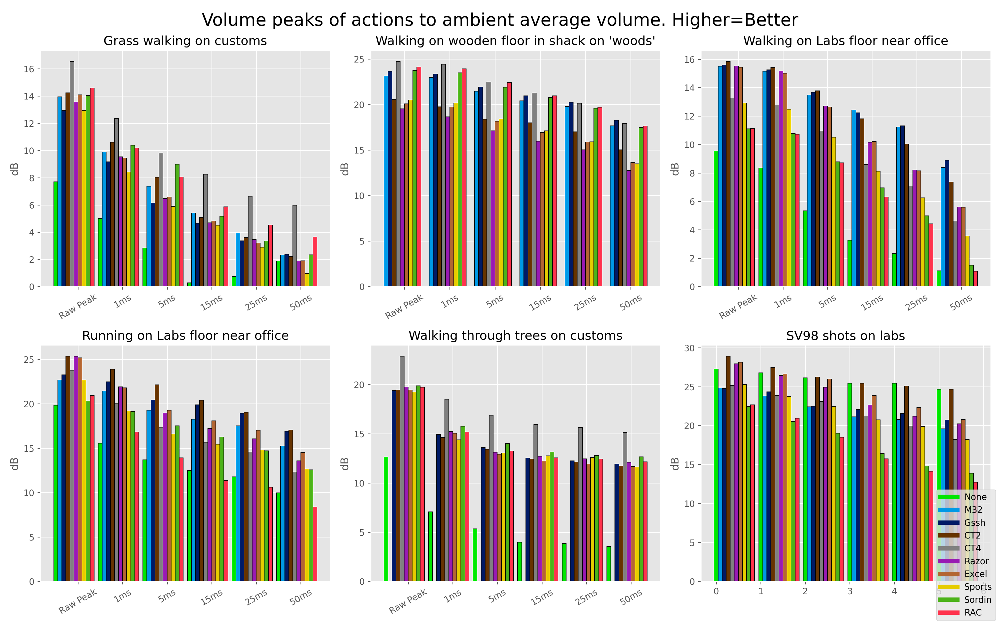
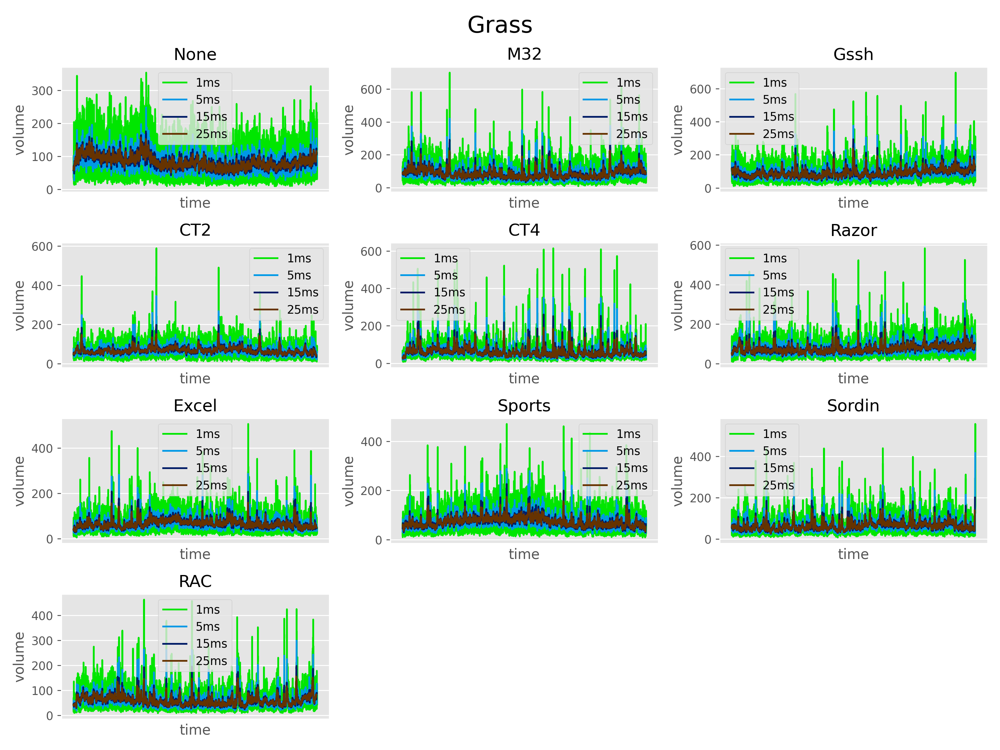

# Tarkov-Sound-Analysis
Sound analysis using different equipment in game `EscapeFromTarkov`

## Analysis spec
- 10 Headphones
- 12 locations

# Extracted results
Comparing peaks when with different smoothing.

# Concluded results
### Estimated score between minimal volume of background compared with active sounds.
Higher is better.

## Preview plots
[Folder](/plots)

## Spectograms
[Folder](spectograms/)

